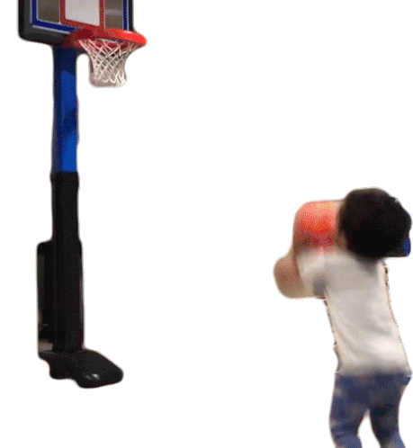
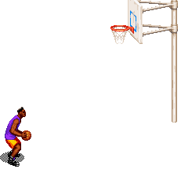

# Alex is getting older, let's hang out
Please join us in celebrating Alex’s birthday with an afternoon of everyone’s favorite schoolyard
blacktop basketball elimination game, [KNOCK OUT](#rules-of-knockout)!

  

## When & Where
Saturday March 19, 11am (<a target="_blank" href="https://calendar.google.com/event?action=TEMPLATE&amp;tmeid=MGpybnU0MjRlcGFqZThvdjFnZHF1c2Q1ajMgZTJoYjdrMnIwbGlpbnA2amhkbm9vdTFlZWNAZw&amp;tmsrc=e2hb7k2r0liinp6jhdnoou1eec%40group.calendar.google.com">google calendar link</a>)

Hanging out, eating pies for lunch and dessert, and a bit of hoops

Alberta Park basketball courts near Killingsworth & NE 22nd
<iframe src="https://www.google.com/maps/embed?pb=!1m18!1m12!1m3!1d2793.2965259467933!2d-122.64728781957962!3d45.56447527920458!2m3!1f0!2f0!3f0!3m2!1i1024!2i768!4f13.1!3m3!1m2!1s0x5495a6e3d71a4269%3A0x779c416cabef73d5!2sAlberta%20Park!5e0!3m2!1sen!2sus!4v1646892531993!5m2!1sen!2sus" width="600" height="450" style="border:0;" allowfullscreen="" loading="lazy"></iframe>

#### The Fine Print
Participation in physical recreation not required; picnicking and children encouraged; we’ll bring
some drinks and savory and sweet pies in honor of Alex’s 3/14 birthday–if you want to bring a pie too, that sort of thing is encouraged, but no pressure!

## FAQ
##### *How do you play knockout?*
Don't worry, just scroll down to see [the rules](#rules-of-knockout).

##### *I want to play but my basketball skills make Mr Magoo look like Shaq, is that a problem?*
Not at all! The goal here is "casual, fun game", not "cutthroat competition", and you will not be alone.

##### *What if I am a literal NBA player?*
If you're *that* good, you'll have to start from three point distance instead of the free throw
line. Halfcourt if you're Damian Lillard. Also, can I have some tickets to the next game? As a
birthday present?

<h2 id="rules-of-knockout">Rules of knockout</h2>

- Everyone forms one line behind the cone a few feet behind the foul line, facing the basket. 
- The first two players in line get a ball. 
- The point of the game is for the second player to make a basket before the person in front of them. 
- The first player takes their first shot from the foul line. 
- As soon as the first player attempts the first shot, the second player may attempt a shot from the foul line.
- If a player misses their first shot from the foul line, they may then rebound and shoot from anywhere on the court. 
- Both players are trying to be the first to make a basket. 
- If the second player makes it before the first player, the first player in line was "knocked out.
- Both players pass their balls to the front of the line and then walk to the end of the line.
- If first player makes a basket first, the player second continues shooting.
- The first layer passes the ball to the next person in line and goes to the end of the line.
- The next person in line shoots a foul shot, now trying to a basket before the player still on the court.
- Once a player scores or is knocked out they should pass their ball to the next person in line as quickly as possible.
- Players can knock each other's basketballs with their own ball. This can only be done when the ball is in the air (not in another player's hands)

  

